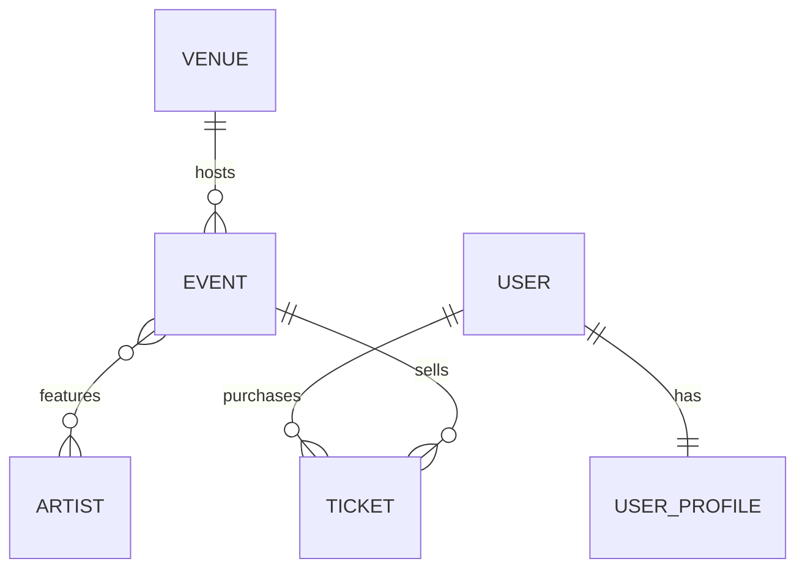

# PulsePass

Plataforma de eventos, artistas y entradas — caso de estudio académico de persistencia con **Java 21 / Spring Boot 4 / Spring Data JPA / PostgreSQL / Flyway / Testcontainers**.

Este README responde a la sección 21 (Definition of Done) y sección 22 (Matriz de trazabilidad) del PRD.

## Integrantes

- Jeremias Esteban Parra Florez
- Aluna Soffia Perea Labastidas

---

## 1. Modelo de datos



| Entidad       | Atributos principales                                                                            |
|---------------|---------------------------------------------------------------------------------------------------|
| `Venue`       | id, code, name, city, address, capacity, active                                                   |
| `Event`       | id, eventCode, name, description, category, status, eventDate, minimumAge, streamingUrl, venue    |
| `Artist`      | id, stageName, country, genre, active                                                             |
| `User`        | id, username, email, active                                                                       |
| `UserProfile` | id, firstName, lastName, phone, city, birthDate, user                                             |
| `Ticket`      | id, ticketCode, type, price, status, purchaseDate, user, event                                    |

**Tablas:** `venues`, `events`, `artists`, `event_artists` (asociativa N:M), `users`, `user_profiles`, `tickets`.

### 1.1 Relaciones

| Relación                 | Tipo | Dueño de la relación (`@JoinColumn` / `@JoinTable`) |
|---------------------------|------|------------------------------------------------------|
| `Venue` → `Event`         | 1:N  | `Event` (FK `venue_id`, `NOT NULL`)                   |
| `Event` ↔ `Artist`        | N:M  | `Event` (`@JoinTable event_artists`), `Artist` usa `mappedBy` |
| `User` ↔ `UserProfile`    | 1:1  | `UserProfile` (FK `user_id`, `UNIQUE` + `NOT NULL`)   |
| `User` → `Ticket`         | 1:N  | `Ticket` (FK `user_id`, `NOT NULL`)                   |
| `Event` → `Ticket`        | 1:N  | `Ticket` (FK `event_id`, `NOT NULL`)                  |

**¿Por qué `Ticket` es una entidad y no un simple `@ManyToMany` entre `User` y `Event`?**
Porque un ticket tiene atributos propios de negocio que no le pertenecen ni a `User` ni a `Event` (`ticketCode`, `type`, `price`, `status`, `purchaseDate`), y porque un mismo usuario puede comprar varios tickets para el mismo evento (VIP + GENERAL, por ejemplo) — algo que una tabla intermedia N:M pura no puede representar, ya que su clave sería el par `(user_id, event_id)` y no permitiría duplicados. `Ticket` es la entidad de negocio central del dominio (BR-006).

### 1.2 Enums

Todos se persisten con `@Enumerated(EnumType.STRING)` (BR-008), nunca por ordinal. Además, `V1__create_schema.sql` los refuerza en PostgreSQL con un `CHECK ... IN (...)` por columna (FR-EVT-003, FR-EVT-004, FR-TKT-004, FR-TKT-005, NFR-001), de modo que la base rechaza valores fuera del catálogo aunque el `INSERT` no venga de Java.

| Enum            | Valores                                                        |
|------------------|-----------------------------------------------------------------|
| `EventCategory` | `MUSIC`, `SPORTS`, `TECHNOLOGY`, `EDUCATION`, `CULTURE`, `ENTERTAINMENT` |
| `EventStatus`   | `DRAFT`, `PUBLISHED`, `SOLD_OUT`, `CANCELLED`, `FINISHED`        |
| `TicketType`    | `GENERAL`, `VIP`, `BACKSTAGE`, `STUDENT`                         |
| `TicketStatus`  | `RESERVED`, `PAID`, `CANCELLED`, `USED`                          |

### 1.3 Integridad de datos (sección 8 del PRD)

| Campo / relación       | Restricción                                  |
|-------------------------|-----------------------------------------------|
| `venues.code`           | `UNIQUE`, `NOT NULL`                          |
| `venues.capacity`       | `CHECK (capacity > 0)`                        |
| `events.event_code`     | `UNIQUE`, `NOT NULL`                          |
| `artists.stage_name`    | `UNIQUE`, `NOT NULL`                          |
| `users.username`        | `UNIQUE`, `NOT NULL`                          |
| `users.email`           | `UNIQUE`, `NOT NULL`                          |
| `user_profiles.user_id` | `FK` + `UNIQUE` (fuerza la relación 1:1)      |
| `tickets.ticket_code`   | `UNIQUE`, `NOT NULL`                          |
| `tickets.price`         | `CHECK (price >= 0)`                          |
| `tickets.user_id` / `event_id` | `FK`, `NOT NULL`                       |
| `events.category`       | `CHECK` con los valores de `EventCategory`    |
| `events.status`         | `CHECK` con los valores de `EventStatus`      |
| `tickets.type`          | `CHECK` con los valores de `TicketType`       |
| `tickets.status`        | `CHECK` con los valores de `TicketStatus`     |
| `event_artists`         | `PK` compuesta `(event_id, artist_id)`        |

---

## 2. Migraciones (Flyway)

Ubicadas en `src/main/resources/db/migration/`.

| Migración                              | Contenido                                                                 |
|-----------------------------------------|----------------------------------------------------------------------------|
| `V1__create_schema.sql`                | Crea las 7 tablas con sus constraints (`UNIQUE`, `CHECK` de rangos y de catálogos de enums), FKs e índices. |
| `V2__insert_initial_artists.sql`       | Inserta el catálogo inicial: Solar Beat, Neon Waves, Caribbean Sound, Ocean Drive, Digital Pulse. |
| `V3__add_streaming_url_to_event.sql`   | Agrega `streaming_url VARCHAR(500)` nullable a `events`, sin modificar V1 (FR-EVT-006, evolución de esquema). |

Hibernate corre en modo `spring.jpa.hibernate.ddl-auto=validate`: **nunca crea ni modifica el esquema**, solo valida que las entidades JPA coincidan con lo que Flyway ya construyó. Si una entidad no coincide con las tablas, la aplicación falla al arrancar.

---

## 3. Repositories y consultas

Clasificación de cada consulta implementada (heredado de `JpaRepository` / Query Method / JPQL):

### `VenueRepository`
| Consulta | Tipo | Cubre |
|---|---|---|
| `findByCode(String)` | Query Method | FR-VEN-001 |

### `EventRepository`
| Consulta | Tipo | Cubre |
|---|---|---|
| `findByEventCode(String)` | Query Method | FR-EVT-002 |
| `findByStatusOrderByEventDateAsc(EventStatus)` | Query Method | FR-EVT-005 |
| `findByVenueCode(String)` | Query Method navegado | FR-VEN-004 |
| `findByArtistStageName(String)` | JPQL (`JOIN` + `DISTINCT`) | FR-SRC-001 / FR-ART-004 |
| `findByCityAndArtistStageName(String, String)` | JPQL (dos asociaciones) | FR-SRC-002 |
| `findRecommendedEvents(LocalDate, String, String)` | JPQL (case-insensitive, `LIKE`, `DISTINCT`, `ORDER BY`) | FR-SRC-003 |

### `ArtistRepository`
| Consulta | Tipo | Cubre |
|---|---|---|
| `findByStageName(String)` | Query Method | FR-ART-002 |

### `UserRepository`
| Consulta | Tipo | Cubre |
|---|---|---|
| `findByEmailIgnoreCase(String)` | Query Method | Sección 14 |

### `UserProfileRepository`
Solo hereda de `JpaRepository`; se accede a `UserProfile` vía `User.getProfile()`.

### `TicketRepository`
| Consulta | Tipo | Cubre |
|---|---|---|
| `findByUserEmail(String)` | Query Method navegado | FR-TKT-006 |
| `findByUserEmailAndStatus(String, TicketStatus)` | Query Method navegado | FR-TKT-006 |
| `findByEventEventCodeAndStatus(String, TicketStatus)` | Query Method navegado | FR-TKT-007 |
| `countPaidTicketsByEventCode(String)` | JPQL (`COUNT`) | FR-TKT-008 |
| `findByEventEventDateAfterOrderByEventEventDateAsc(LocalDate)` | Query Method navegado | FR-SRC-004 (Could) |

**Sobre FR-TKT-007** (pregunta 3, sección 23): se eligió **Query Method** en vez de JPQL porque es un filtro de igualdad simple sobre dos propiedades navegadas (`event.eventCode`, `status`), sin agregaciones ni múltiples joins — el nombre del método ya es autoexplicativo. Esto contrasta con FR-SRC-002, que cruza dos asociaciones distintas (`venue` y `artists`) y por eso sí requiere JPQL explícito.

---

## 4. Cómo ejecutar el proyecto

Requisitos: Java 21, Maven (o el wrapper `mvnw` incluido), Docker Desktop corriendo (para Testcontainers).

```bash
# Compilar
./mvnw clean compile

# Correr la aplicación (requiere PostgreSQL local en application.properties)
./mvnw spring-boot:run
```

**Nota:** si ya habías ejecutado la aplicación contra una base local `pulsepass` con una versión anterior de `V1__create_schema.sql`, Flyway detectará que el checksum cambió y fallará al arrancar. En ese caso borra y recrea la base local (o usa `flyway repair`). Las pruebas no se ven afectadas, porque Testcontainers crea una base nueva en cada ejecución.

## 5. Cómo correr las pruebas

Las pruebas de integración (`PersistenceIntegrationTest`) usan **Testcontainers**: levantan un contenedor real de PostgreSQL (`postgres:16-alpine`), corren las migraciones de Flyway desde cero, y ejecutan todos los repositories y consultas contra esa base — no contra H2 ni ningún mock.

```bash
./mvnw clean test
```

**Requisito:** Docker Desktop debe estar corriendo. La primera ejecución descarga la imagen `postgres:16-alpine` (~110 MB); las siguientes son instantáneas porque la imagen queda cacheada localmente.

Resultado esperado: `BUILD SUCCESS` con los 35 tests en verde (QT-010): 34 en `PersistenceIntegrationTest` más `contextLoads` en `PulsepassApplicationTests`.

### Cobertura de pruebas

| Criterio | Qué verifica |
|---|---|
| QT-001 | Flyway aplica V1, V2 y V3 desde una base vacía; catálogo de artistas cargado |
| QT-002 | Hibernate valida el esquema (no lo crea/actualiza) |
| QT-003 | Relación `Venue` 1:N `Event` |
| QT-004 | Relación `User` 1:1 `UserProfile` |
| QT-005 | Relación `Event` N:M `Artist`; agregar dos veces el mismo artista no duplica la asociación (nivel Java, gracias al `Set`) |
| QT-006 | `Ticket → User` y `Ticket → Event`; enums persistidos como texto |
| QT-007 | Query Methods simples y navegados |
| QT-008 | JPQL con `JOIN` y `COUNT`; el `DISTINCT` se comprueba con un artista parcial (`"a"`) que coincide con los tres artistas de un mismo evento y aun así lo devuelve una sola vez |
| QT-009 | Restricciones `UNIQUE` reales (`saveAndFlush` + `DataIntegrityViolationException`) y la PK compuesta de `event_artists`, que rechaza en PostgreSQL un par evento-artista duplicado |
| NFR-001 | `CHECK` reales en PostgreSQL: `capacity > 0`, `price >= 0` y `status` de evento fuera del catálogo |
| QT-010 | `mvn clean test` termina en `BUILD SUCCESS` |

Los 8 criterios de aceptación funcionales (AC-001 a AC-008) de la sección 11 del PRD están cubiertos dentro de los tests anteriores (ver `@DisplayName` de cada test en `PersistenceIntegrationTest.java` para el mapeo exacto).

**Nota sobre SQL nativo:** unos pocos tests usan SQL nativo solo para verificar el estado real de la base (`flyway_schema_history`, filas de `event_artists`, texto de los enums, un `INSERT` con un estado inválido y un `INSERT` de un par duplicado en `event_artists`). Ninguna consulta de los requisitos del taller (sección 4 del PRD) usa SQL nativo: todas son heredadas, Query Methods o JPQL.

---

## 6. Matriz de trazabilidad (sección 22 del PRD)

| Requisito     | Dominio                  | Repository                          | Test |
|----------------|----------------------------|----------------------------------------|------|
| `FR-VEN-*`     | Venue                     | `VenueRepository`                      | `PersistenceIntegrationTest` |
| `FR-EVT-*`     | Event + Venue             | `EventRepository`                      | `PersistenceIntegrationTest` |
| `FR-ART-*`     | Event + Artist            | `EventRepository` / `ArtistRepository` | `PersistenceIntegrationTest` |
| `FR-USR-*`     | User + UserProfile        | `UserRepository`                       | `PersistenceIntegrationTest` |
| `FR-TKT-*`     | Ticket + User + Event     | `TicketRepository`                     | `PersistenceIntegrationTest` |
| `FR-SRC-*`     | Event / Artist / Venue    | `EventRepository`                      | `PersistenceIntegrationTest` |
| `NFR-002/003`  | Flyway                    | N/A                                     | `PersistenceIntegrationTest` |
| `NFR-004/005`  | Testcontainers            | N/A                                     | `PersistenceIntegrationTest` |

---

## 7. Preguntas para el equipo (sección 23 del PRD)

1. **¿Por qué `Ticket` debe ser una entidad en lugar de un `@ManyToMany` entre `User` y `Event`?**
   Porque tiene atributos propios (`ticketCode`, `type`, `price`, `status`, `purchaseDate`) que no pertenecen a ninguna de las dos entidades relacionadas, y porque un usuario puede comprar más de un ticket para el mismo evento — algo que una tabla intermedia N:M pura no permite representar sin violar su propia clave compuesta.

2. **¿Qué reglas pertenecen a PostgreSQL y cuáles deberían quedar para una futura capa Service?**
   A PostgreSQL le corresponden las reglas de **integridad estructural**: unicidad, no-nulidad, claves foráneas, rangos válidos y catálogos cerrados de valores (`CHECK`, incluidos los estados, categorías y tipos de los enums) — cosas que deben cumplirse siempre, sin excepción, sin importar qué aplicación escriba en la base. A una capa Service futura le correspondería la **lógica de negocio dinámica**: por ejemplo, impedir la venta de tickets si el evento está `SOLD_OUT`, calcular descuentos, o validar reglas que cambian con el tiempo y no deberían obligar a una migración de esquema cada vez que cambian.

3. **¿Qué consultas pueden expresarse claramente como Query Methods y cuáles justifican JPQL?**
   Un Query Method es apropiado cuando la consulta es un filtro de igualdad/comparación simple sobre una o dos propiedades navegadas, y el nombre del método ya explica qué hace (ej. `findByEventEventCodeAndStatus`). JPQL se justifica cuando hace falta `DISTINCT` para evitar duplicados de un `JOIN` a una relación N:M, cuando se cruzan varias asociaciones distintas en la misma condición (ej. `venue.city` + `artists.stageName`), o cuando se necesita una función de agregación como `COUNT`.

4. **¿Qué consecuencias tendría modificar V1 después de haberla aplicado en un ambiente compartido?**
   Flyway calcula un checksum de cada migración aplicada. Si se modifica `V1__create_schema.sql` después de que ya corrió en cualquier ambiente compartido, Flyway detectará el checksum distinto y **rechazará** ejecutar más migraciones en ese ambiente hasta que se repare manualmente el historial (`flyway repair`) o se revierta el cambio — puede dejar el pipeline de CI/CD roto para todo el equipo. Por eso los cambios de esquema posteriores deben ir siempre en una migración nueva (como se hizo con V3), nunca editando una ya aplicada.
   En este proyecto, V1 solo tuvo una versión: nunca fue aplicada por Flyway (ni en local ni en Testcontainers) antes de llegar a su forma final, por lo que no existió ningún checksum previo que pudiera romperse. La distinción que sí es real y aplica hacia adelante: si ahora quisiéramos agregar, por ejemplo, otro `CHECK` a `venues`, la forma correcta sería una migración nueva (`V4__...sql`), nunca editar `V1__create_schema.sql` directamente — precisamente para no reproducir el escenario de checksum roto que describe el párrafo anterior.

5. **¿Qué diferencias podría ocultar una prueba con H2 frente a PostgreSQL?**
   H2 no implementa el mismo dialecto SQL que PostgreSQL: puede aceptar sintaxis que Postgres rechaza (o viceversa), y sus mensajes de error ante violaciones de constraints son distintos. Más importante: H2 no siempre refuerza `CHECK` constraints, tipos de datos exactos (como `NUMERIC(10,2)`), ni el comportamiento real de índices y locks bajo concurrencia. Un test que pasa en H2 podría fallar silenciosamente en producción sobre PostgreSQL real — por eso este taller usa Testcontainers con PostgreSQL real en vez de una base en memoria.

6. **¿Cómo evolucionaría el modelo para soportar inventario de tickets y evitar sobreventa?**
   Se necesitaría una tabla de inventario por evento y tipo de ticket (ej. `event_ticket_inventory` con `event_id`, `ticket_type`, `total_capacity`, `sold_count`), con un `CHECK (sold_count <= total_capacity)`. La compra de un ticket tendría que incrementar `sold_count` de forma atómica (usando un `UPDATE ... WHERE sold_count < total_capacity` o un lock optimista con `@Version`) para evitar condiciones de carrera cuando dos usuarios compran el último cupo al mismo tiempo.

---

## 8. Stack técnico

- Java 21
- Spring Boot 4.1.1
- Spring Data JPA / Hibernate 7.4.5
- PostgreSQL (driver 42.7.13)
- Flyway 12.4.0
- Testcontainers 2.0.5
- JUnit 5 / Spring Boot Test